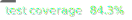
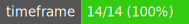
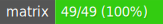
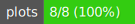

[](https://www.npmjs.com/package/pinets)
[](https://opensource.org/licenses/AGPL-3.0)
[](./.github/badges/coverage.svg)
[](https://quantforgeorg.github.io/PineTS/)
[](https://www.reddit.com/r/QuantForge/)

---

This project aims to provide a Javascript/Typescript port for Tradingview's Pine Script.
The current version does not run Pine Script directly, instead it runs a close Javascript equivalent called PineTS.

PineTS makes it possible to migrate Pine Script v5+ indicators to Javascript/Typescript, in order to run them in a Javascript environment.

> _Disclaimer : PineTS is an independent project and is not affiliated with, endorsed by, or associated with TradingView or Pine Script™. All trademarks and registered trademarks mentioned belong to their respective owners._

## Overview

PineTS enables seamless conversion of Pine Script indicators to JavaScript/TypeScript code. It preserves the original functionality and behavior while providing robust handling of time-series data processing, technical analysis calculations, and Pine Script's distinctive scoping mechanisms.

## See it in action

Bellow are two ports of Pine Script indicators running in the browser.
PineTS is used to generate plot data, and tradingview light weight chart is used to display the plot.

-   [Williams Vix Fix](https://quantforgeorg.github.io/PineTS/indicators/willvixfix/)
-   [Squeeze Momentum](https://quantforgeorg.github.io/PineTS/indicators/sqzmom/)

## Key Features

-   **Pine Script Compatibility**: Supports Pine Script v5+ syntax and functionality
-   **High Precision**: Aims for the same precision as Pine Script (up to the 8th digit)
-   **Time-Series Processing**: Handles historical data and series operations
-   **Technical Analysis Functions**: Comprehensive set of TA indicators and calculations
-   **Mathematical Operations**: Advanced mathematical functions and precision handling
-   **Input Management**: Flexible parameter and input handling system
-   **Context Management**: Maintains proper scoping and variable access rules
-   **Runtime Transpilation**: Converts PineTS code to executable JavaScript at runtime

## Core Components

### PineTS Class

The main class that handles:

-   Market data management
-   Series calculations
-   Built-in variables (open, high, low, close, volume, etc.)
-   Runtime execution context

### Namespaces

-   **Core**: Essential Pine Script functionality and base operations
-   **TechnicalAnalysis**: Comprehensive set of technical indicators and analysis functions
-   **PineMath**: Mathematical operations and precision handling
-   **Input**: Parameter and input management system
-   **Syminfo**: Symbol information and market data helpers

## Installation

```bash
npm install pinets
```

## Usage Example

### Converting Pine Script to PineTS

Original Pine Script:

<table width="100%">
<tr>
<td>

```javascript
/*==[ Original Pine Script ]==*/

//@version=5
indicator('My EMA Cross Strategy');

ema9 = ta.ema(close, 9);
ema18 = ta.ema(close, 18);

bull_bias = ema9 > ema18;
bear_bias = ema9 < ema18;

prev_close = close[1];
diff_close = close - prev_close;

_oo = open;
_oo = math.abs(open[1] - close[2]);
```

</td>
<td>

```javascript
/*==[ Equivalent PineTS ]==*/

//
//'My EMA Cross Strategy';

let ema9 = ta.ema(close, 9);
let ema18 = ta.ema(close, 18);

let bull_bias = ema9 > ema18;
let bear_bias = ema9 < ema18;

let prev_close = close[1];
let diff_close = close - prev_close;

let _oo = open;
_oo = math.abs(open[1] - close[2]);
```

</td>
</tr>
</table>

### Running PineTS Code

```javascript
import { PineTS, Provider } from 'pinets';

// Initialize with market data
const pineTS = new PineTS(Provider.Binance, 'BTCUSDT', 'D', 100);

// Run your indicator
const { result } = await pineTS.run((context) => {
    const { ta, math } = context;
    const { close, open } = context.data;

    let ema9 = ta.ema(close, 9);
    let ema18 = ta.ema(close, 18);

    let bull_bias = ema9 > ema18;
    let bear_bias = ema9 < ema18;

    let prev_close = close[1];
    let diff_close = close - prev_close;

    let _oo = open;
    _oo = math.abs(open[1] - close[2]);

    return { ema9, ema18, bull_bias, bear_bias };
});
```

> **📖 For detailed documentation on initialization options, parameters, and advanced usage, see the [Initialization and Usage Guide](https://quantforgeorg.github.io/PineTS/initialization-and-usage/)**

## Key Differences from Pine Script

1. **Variable Declaration**: Use JavaScript's `const`, `let`, and `var` instead of Pine Script's implicit declaration
2. **Function Syntax**: JavaScript arrow functions and standard function syntax
3. **Module System**: Pine Script native types should be imported using syntax like : const ta = context.ta; const {close, open} = context.data;
4. **Scoping Rules**: Maintains Pine Script's series behavior through runtime transformation
5. **Return syntax**: PineTS can returns an object with the results of the indicator, allowing you to get the results of the indicator in a single call.

## Project Goals

PineTS aims for **full coverage** of Pine Script functions and capabilities. The ultimate goal is to enable running **original Pine Script code directly** without manual conversion to PineTS syntax.
However, at the current stage, PineTS syntax allows running indicators with low conversion effort because it shares a vary close syntax with Pine Script.

**Current Progress (v0.6.1)**:

-   ✅ Runtime Transpiler (PineTS => JS)
-   🚧 Pine to PineTS transpiler to allow running pine scripts directly (In-progress)
-   ✅ Core Pine Script functions and variables (~75% coverage)
-   ✅ Series and scope management
-   ✅ Technical analysis functions (60+ indicators)
-   ✅ Mathematical functions
-   ✅ Arrays and Matrices (90+ operations)
-   ✅ Input handling
-   ✅ Plots data handling
-   🚧 Market data connectors (Binance supported, others will be added)
-   ✅ Realtime execution
-   🚧 Visualization (In-progress)
-   🚧 Scripts and Market data caching (In-progress)
-   🎯 Strategy execution (planned)
-   🎯 Backtesting and simulation (planned)

## Technical Details

The library uses a runtime transpiler that:

1. Transforms PineTS code to handle time-series data
2. Manages variable scoping and context
3. Handles array indexing and series operations
4. Provides Pine Script-compatible function calls

### Pine Script API Coverage

#### Data

[](https://quantforgeorg.github.io/PineTS/api-coverage/syminfo.html)
[](https://quantforgeorg.github.io/PineTS/api-coverage/session.html)
[](https://quantforgeorg.github.io/PineTS/api-coverage/timeframe.html)
[](https://quantforgeorg.github.io/PineTS/api-coverage/barstate.html)
[](https://quantforgeorg.github.io/PineTS/api-coverage/ticker.html)
[](https://quantforgeorg.github.io/PineTS/api-coverage/builtin.html)

#### Calculation

[](https://quantforgeorg.github.io/PineTS/api-coverage/ta.html)
[](https://quantforgeorg.github.io/PineTS/api-coverage/math.html)
[](https://quantforgeorg.github.io/PineTS/api-coverage/array.html)
[](https://quantforgeorg.github.io/PineTS/api-coverage/map.html)
[](https://quantforgeorg.github.io/PineTS/api-coverage/matrix.html)
[](https://quantforgeorg.github.io/PineTS/api-coverage/request.html)
[](https://quantforgeorg.github.io/PineTS/api-coverage/types.html)
[](https://quantforgeorg.github.io/PineTS/api-coverage/strategy.html)
[](https://quantforgeorg.github.io/PineTS/api-coverage/input.html)

#### Visualization

[](https://quantforgeorg.github.io/PineTS/api-coverage/color.html)
[](https://quantforgeorg.github.io/PineTS/api-coverage/plots.html)
[](https://quantforgeorg.github.io/PineTS/api-coverage/chart.html)
[](https://quantforgeorg.github.io/PineTS/api-coverage/label.html)
[](https://quantforgeorg.github.io/PineTS/api-coverage/line.html)
[](https://quantforgeorg.github.io/PineTS/api-coverage/polyline.html)
[](https://quantforgeorg.github.io/PineTS/api-coverage/box.html)
[](https://quantforgeorg.github.io/PineTS/api-coverage/table.html)
[](https://quantforgeorg.github.io/PineTS/api-coverage/linefill.html)

#### Logging

[](https://quantforgeorg.github.io/PineTS/api-coverage/log.html)
[](https://quantforgeorg.github.io/PineTS/api-coverage/str.html)

---

## Contributing

Contributions are welcome! Please feel free to submit pull requests, create issues, or suggest improvements.

## License

This project is open-source and available under the AGPL License.

## Disclaimer

PineTS is an independent project and is not affiliated with, endorsed by, or associated with TradingView or Pine Script. All trademarks and registered trademarks mentioned belong to their respective owners.
